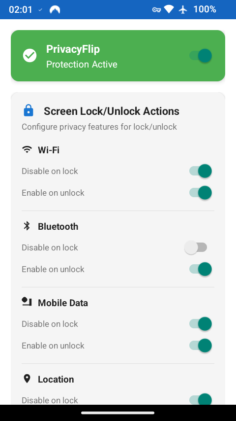
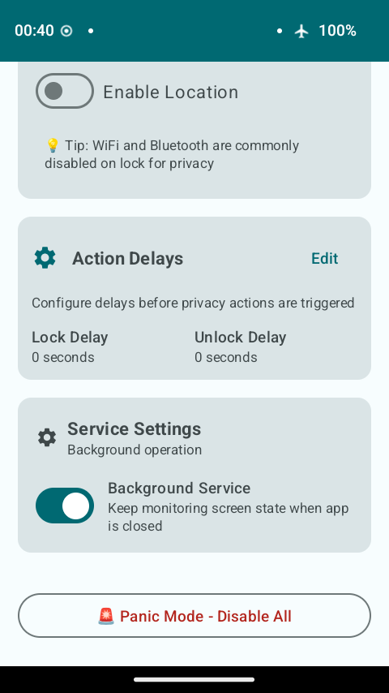

# PrivacyFlip

**Automatic lock/unlock privacy control for rooted Android devices 🔐📱✨**

PrivacyFlip automatically manages your device's privacy features based on lock/unlock state. When you lock your device, it disables Wi-Fi, Bluetooth, mobile data, and location services. When you unlock, it intelligently restores the features you want back on.

[](https://f-droid.org)
[](https://developer.android.com)
[](https://en.wikipedia.org/wiki/Rooting_(Android))
[](LICENSE)

<div align="center">
  
  
</div>

## 🔒 Features

### **Automatic Privacy Control**
- **Lock Detection**: Instantly disables privacy features when screen locks
- **Unlock Detection**: Waits for proper authentication (not just screen-on)
- **Smart Restoration**: Configurable feature re-enabling on unlock

### **Privacy Features Controlled**
- 📶 **Wi-Fi** - Disable/enable wireless connectivity
- 📱 **Bluetooth** - Control Bluetooth radio
- 📡 **Mobile data** - Manage cellular data connection
- 📍 **Location services** - Control GPS and location tracking

### **Customizable Timing**
- **Lock Delay**: 0-300 seconds before privacy actions trigger
- **Unlock Delay**: 0-60 seconds before features are restored
- **Instant Mode**: Set delays to 0 for immediate action

## 📱 Requirements

- **Android 5.0+** (API level 21 and newer)
- **Root access** (Magisk, SuperSU, or similar)
- **Rooted device** with su binary available

## 🚀 Installation

### From F-Droid (Recommended - Pending Approval)
PrivacyFlip has been submitted to F-Droid and is awaiting approval. Once approved:

1. Install [F-Droid](https://f-droid.org/) if you haven't already
2. Search for "PrivacyFlip" in F-Droid
3. Install directly from F-Droid for automatic updates

### Manual Installation
1. Download the latest APK from [Releases](https://github.com/dorumrr/privacyflip/releases)
2. Enable "Unknown sources" in Android settings
3. Install the APK
4. Grant root permissions when prompted

### Build from source
```bash
git clone https://github.com/dorumrr/privacyflip.git
cd privacyflip
./gradlew assembleDebug
adb install app/build/outputs/apk/debug/PrivacyFlip-v1.0.0-debug.apk
```

### F-Droid Metadata
This repository includes Fastlane metadata structure in `fastlane/metadata/` for F-Droid compatibility.

## 🔧 Usage

### **First launch**
1. Open PrivacyFlip
2. Grant root permissions when prompted
3. Configure your preferred privacy settings
4. Set lock/unlock delays if desired

### **Configuration**
- **Action Delays**: Click "Edit" to modify timing settings
- **Screen Lock Actions**: Configure which features to disable/enable
- **Panic Mode**: Tap the red button for emergency privacy

### **Automatic operation**
Once configured, PrivacyFlip works automatically:
- Lock your device → Privacy features disabled (with toast notification)
- Unlock your device → Selected features restored (with toast notification)

## 🛡️ Privacy & Security

### **Data collection**
- **Zero telemetry** - No data sent to external servers
- **Local storage only** - All settings stored on device
- **No network permissions** - App cannot access internet
- **Open source** - Full code transparency

### **Permissions**
- **Root access**: Required for system-level privacy control
- **Screen state monitoring**: For lock/unlock detection via broadcast receivers
- **Foreground service**: For persistent background monitoring
- **Notification**: For privacy change alerts (Android 13+)

## 🤝 Contributing

**Contributions are welcome!** Here's how you can help improve PrivacyFlip:

- 🐛 **Found a bug?** Open an issue or submit a PR with the fix
- 💡 **Have an idea?** Create an issue to discuss new features
- 📝 **Improve documentation?** Fix typos, add examples, or clarify instructions
- 🔧 **Code improvements?** Optimise performance, add tests, or refactor

**Simple workflow:**
1. Fork the repository
2. Create a feature branch (`git checkout -b feature/amazing-feature`)
3. Make your changes and test them
4. Commit your changes (`git commit -m 'Add amazing feature'`)
5. Push to your branch (`git push origin feature/amazing-feature`)
6. Open a Pull Request

**Development setup:**
```bash
git clone https://github.com/dorumrr/privacyflip.git
cd privacyflip
./gradlew build
./test_dev.sh install  # Test on device/emulator
```

No contribution is too small - every improvement helps the privacy community! 🚀

## 📄 License

This project is licensed under the GNU General Public License v3.0

## 👨‍💻 Author

**Created by [Doru Moraru](https://github.com/dorumrr/privacyflip)**

## 🙏 Acknowledgments

- [libsu](https://github.com/topjohnwu/libsu) - Reliable root access library
- [Material Design 3](https://m3.material.io/) - Modern UI components
<!-- NOT YET PUBLISHED
- F-Droid community for privacy-focused app distribution
-->
- Degoogled Android community for inspiration and feedback

## 📞 Support

- **Issues**: [GitHub Issues](https://github.com/dorumrr/privacyflip/issues)
<!-- NOT YET PUBLISHED
**F-Droid**: [App Page](https://f-droid.org/packages/io.github.dorumrr.privacyflip)
-->

---

**PrivacyFlip** - Flip your privacy on demand! 🔐📱✨
