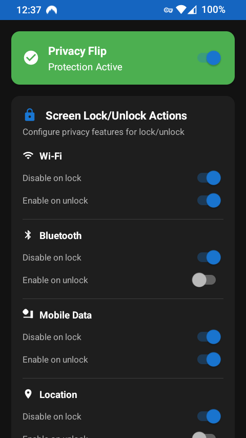
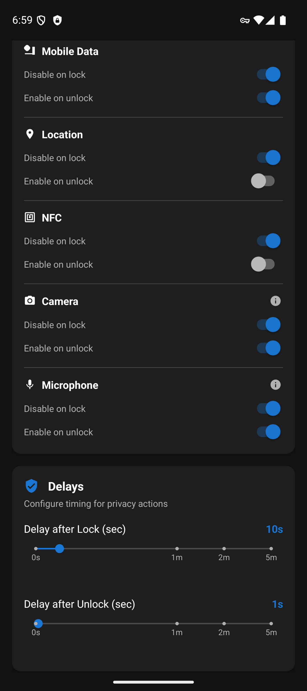

# PrivacyFlip

**Automatic lock/unlock privacy control for Android devices 🔐📱✨**

**PrivacyFlip** automatically manages your Android device's privacy features based on lock/unlock state. When you lock your device, it can disable **Wi-Fi**, **Bluetooth**, **mobile data**, **location** services, **NFC**, and even **camera/microphone sensors**. When you unlock, it intelligently restores the features you want back on.

**Works with Shizuku or Root** - Choose your preferred privilege method!

   
   
  

## 📸 Screenshots

  
  

## 🔒 Features

### **Automatic Privacy Control**
- **Lock Detection**: Instantly disables privacy features when screen locks
- **Unlock Detection**: Waits for proper authentication (not just screen-on)
- **Smart Restoration**: Configurable feature re-enabling on unlock

### **Privacy Features Controlled**
- 📶 **Wi-Fi** - Disable/enable wireless connectivity
- 📱 **Bluetooth** - Control Bluetooth radio
- 📡 **Mobile data** - Manage cellular data connection
- 📍 **Location services** - Control GPS and location tracking
- 📳 **NFC** - Control Near Field Communication sensor
- 📷 **Camera** - Disable/enable camera sensor privacy (Android 12+)
- 🎤 **Microphone** - Disable/enable microphone sensor privacy (Android 12+)

> **Note:** Camera and microphone controls require a timing window between screen lock and device lock. Tap the info icon next to these features in the app for configuration details if not working as expected.

### **Customizable Timing**
- **Lock Delay**: 0-60 seconds before privacy actions trigger
- **Unlock Delay**: 0-60 seconds before features are restored
- **Instant Mode**: Set delays to 0 for immediate action

## 📱 Requirements

**Minimum:** Android 7.0+ (API level 24)
**Camera/Microphone Features:** Android 12+ (API level 31)

**Choose ONE of the following privilege methods:**

### **Option 1: Root Access** (Recommended for rooted devices)
- **Root access** via Magisk, SuperSU, or similar
- **Best performance** with UID 0 privileges

### **Option 2: Shizuku** (For non-rooted devices)
- **[Shizuku app](https://shizuku.rikka.app/)** installed and running
- **ADB privileges** via USB debugging or wireless ADB
- **No root required** - works with ADB-level permissions

### **Option 3: Sui** (Best of both worlds)
- **Rooted device** with Magisk installed
- **[Sui Magisk module](https://github.com/RikkaApps/Sui)** installed
- **Best user experience** - no permission prompts, automatic startup

## 🏗️ Architecture & Dependencies

- **Zero Google Dependencies** - Complete F-Droid compliance
- **Pure AndroidX** - Modern Android development without Google services
- **Traditional Android Views** - Efficient UI with ViewBinding
- **Navigation Component** - Fragment-based navigation
- **MVVM Pattern** - Reactive architecture with LiveData
- **Dual Privilege Support** - Abstraction layer for Root and Shizuku

### **Key Dependencies**
- **[libsu](https://github.com/topjohnwu/libsu)** - Reliable root access management
- **[Shizuku API](https://github.com/RikkaApps/Shizuku-API)** - ADB privilege management
- **[Sui](https://github.com/RikkaApps/Sui)** - Magisk module for Shizuku API
- **AndroidX Core Libraries** - Modern Android framework components
- **Work Manager** - Background task scheduling
- **Navigation Component** - Fragment navigation (Google Material excluded)
- **ViewBinding** - Type-safe view references

### **Privilege Detection Priority**
1. **Sui** - Magisk module providing Shizuku API with root (best UX)
2. **Root** - Traditional root access via Magisk/SuperSU
3. **Shizuku** - ADB privileges via Shizuku app (no root required)

## 🤝 Contributing

Help make this app better. No contribution is too small!

### How to Contribute

1. **Fork the repository**
2. **Create a feature branch** (`git checkout -b feature/amazing-feature`)
3. **Make your changes**
4. **Commit your changes** (`git commit -m 'Add some amazing feature'`)
5. **Push to the branch** (`git push origin feature/amazing-feature`)
6. **Open a Pull Request**

All contributions are **valued** and **appreciated**!

## 📄 License

This project is licensed under the MIT License - see the [LICENSE](LICENSE) file for details.

## 💖 Support Development

PrivacyFlip protects your privacy. You can protect its future!

---

*Giving Privacy its due, by Doru Moraru*
