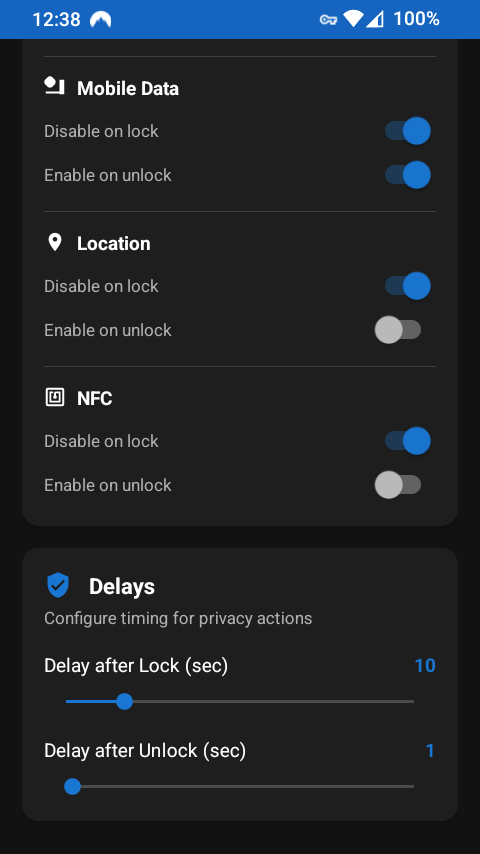

# PrivacyFlip

**Automatic lock/unlock privacy control for rooted Android devices 🔐📱✨**

**PrivacyFlip** automatically manages your device's privacy features based on lock/unlock state. When you lock your device, it can disable **Wi-Fi**, **Bluetooth**, **mobile data**, **location** services, and **NFC**. When you unlock, it intelligently restores the features you want back on.

    

<!--  -->

## 📸 Screenshots

  
  

## 🔒 Features

### **Automatic Privacy Control**
- **Lock Detection**: Instantly disables privacy features when screen locks
- **Unlock Detection**: Waits for proper authentication (not just screen-on)
- **Smart Restoration**: Configurable feature re-enabling on unlock

### **Privacy Features Controlled**
- 📶 **Wi-Fi** - Disable/enable wireless connectivity
- 📱 **Bluetooth** - Control Bluetooth radio
- 📡 **Mobile data** - Manage cellular data connection
- 📍 **Location services** - Control GPS and location tracking
- 📳 **NFC** - Control Near Field Communication sensor

### **Customizable Timing**
- **Lock Delay**: 0-60 seconds before privacy actions trigger
- **Unlock Delay**: 0-60 seconds before features are restored
- **Instant Mode**: Set delays to 0 for immediate action

## 📱 Requirements

- **Android 5.0+** (API level 21 and newer)
- **Root access** (Magisk, SuperSU, or similar)
- **Rooted device** with su binary available

## 🏗️ Architecture & Dependencies

- **Zero Google Dependencies** - Complete F-Droid compliance
- **Pure AndroidX** - Modern Android development without Google services
- **Traditional Android Views** - Efficient UI with ViewBinding
- **Navigation Component** - Fragment-based navigation
- **MVVM Pattern** - Reactive architecture with LiveData

### **Key Dependencies**
- **[libsu](https://github.com/topjohnwu/libsu)** - Reliable root access management
- **AndroidX Core Libraries** - Modern Android framework components
- **Work Manager** - Background task scheduling
- **Navigation Component** - Fragment navigation (Google Material excluded)
- **ViewBinding** - Type-safe view references

## 🤝 Contributing

Help make this app better. No contribution is too small!

### How to Contribute

1. **Fork the repository**
2. **Create a feature branch** (`git checkout -b feature/amazing-feature`)
3. **Make your changes**
4. **Commit your changes** (`git commit -m 'Add some amazing feature'`)
5. **Push to the branch** (`git push origin feature/amazing-feature`)
6. **Open a Pull Request**

All contributions are **valued** and **appreciated**!

## 📄 License

This project is licensed under the MIT License - see the [LICENSE](LICENSE) file for details.

## 💖 Support Development

PrivacyFlip protects your privacy. You can protect its future!

---

*Giving Privacy its due, by Doru Moraru*
